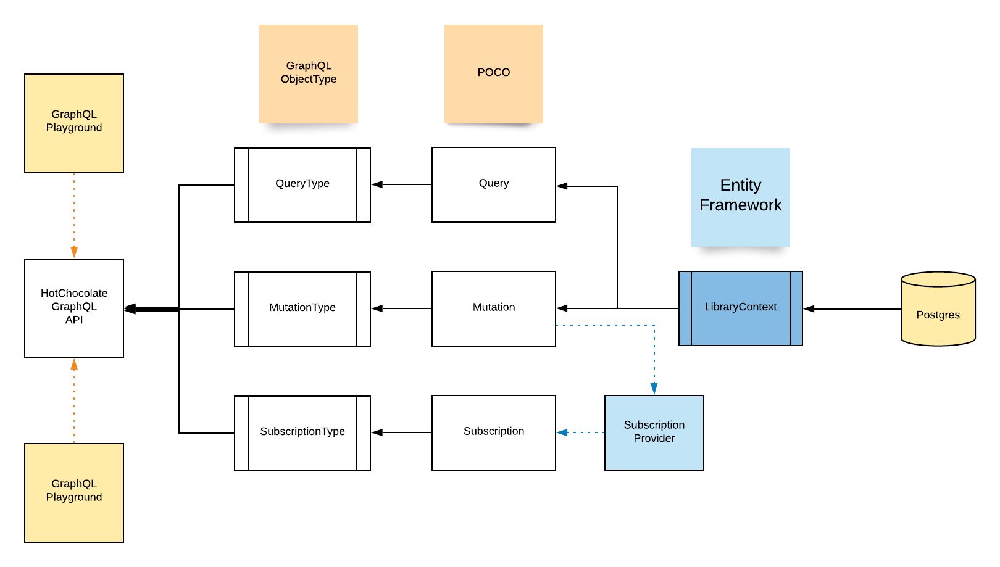
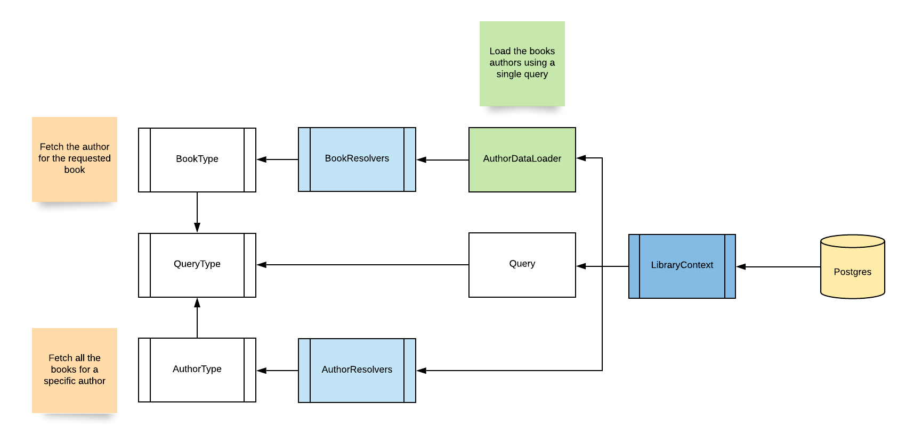

# 2020-06-18-graphql-dot-net-lightning-talk

Get the slides [here](https://docs.google.com/presentation/d/e/2PACX-1vRXGBM3i3cEvcldUK7y3DDupmd2oXrX1RH_LKhNuFNM4u7-ta4-WMNRXo51pGnBapLfzueYkHh24y5Y/pub?start=false&loop=false&delayms=3000)

This application demonstrates the following concepts of GraphQL:

- Queries
- Mutations
- Subscriptions

---

## How to run this app

This app uses Docker with a Docker Compose configuration. This will spin up the following resources:

- A PostgreSQL Database
- A .NET Core Web API
- A React Web App

As long as you have Docker installed you can spin up the app with

```bash
docker-compose up
```

### How to access the app when it is running

Here are the links that you will be able to access:

- [http://localhost:3000]() - This is the Web App
- [http://localhost:5000/playground]() - This is the GraphQL Playground
- [http://localhost:5000/voyager]() - This allows you to see a visual representation of your GraphQL Schema
- [http://localhost:8080]() - The Adminer app, which allows you to see what is in the database _(creds in docker-compose.yml)_

---

## Troubleshooting

- A docker container is already using the port
  - Run `docker stop $(docker ps -aq)` in the terminal to stop all running containers

---

## Some visuals

### How the API classes are built



### How the Data Loaders and Resolvers are used


